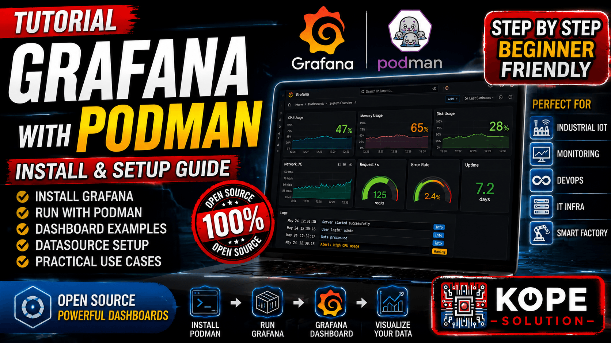

# Grafana with Podman

Step-by-Step guide for installing Grafana using Podman on Linux / WSL Ubuntu.



---

## Install Podman

```bash
sudo apt update
sudo apt install -y podman
```

Verify installation:

```bash
podman --version
```

---

## Pull Grafana Image

```bash
podman pull docker.io/grafana/grafana:latest
```

---

## Create Persistent Folder

```bash
mkdir -p ~/grafana-data
chmod 777 ~/grafana-data
```

---

## Run Grafana Container

```bash
podman run -d \
  --name grafana \
  -p 3000:3000 \
  -v ~/grafana-data:/var/lib/grafana:Z \
  --restart=unless-stopped \
  docker.io/grafana/grafana:latest
```

---

## Verify Running Container

```bash
podman ps
```

Example:

```text
CONTAINER ID  IMAGE                           STATUS         PORTS
xxxxxxxxxxxx  grafana/grafana:latest         Up xx seconds  0.0.0.0:3000->3000/tcp
```

---

## View Container Logs

```bash
podman logs grafana
```

or

```bash
podman logs -f grafana
```

---

## Access Grafana

Open browser:

```text
http://localhost:3000
```

or

```text
http://SERVER_IP:3000
```

---

## Default Login

| Username | Password |
|---|---|
| admin | admin |

Grafana will ask you to change password after first login.

---

## Useful Commands

### Stop Container

```bash
podman stop grafana
```

---

### Start Container

```bash
podman start grafana
```

---

### Restart Container

```bash
podman restart grafana
```

---

### Remove Container

```bash
podman rm -f grafana
```

---

## Persistent Storage

Grafana data is stored inside:

```text
~/grafana-data
```

This allows dashboards and settings to remain after container restart.

---

## Example Architecture


---

## Industrial Use Cases

- PLC Dashboard
- SCADA Monitoring
- MQTT Visualization
- Energy Monitoring
- Industrial IoT
- Factory Dashboard
- Real-Time Monitoring
- Production Dashboard

---

## Related Technologies

- Grafana
- Podman
- MQTT
- Node-RED
- PLC
- SCADA
- InfluxDB
- Industrial IoT